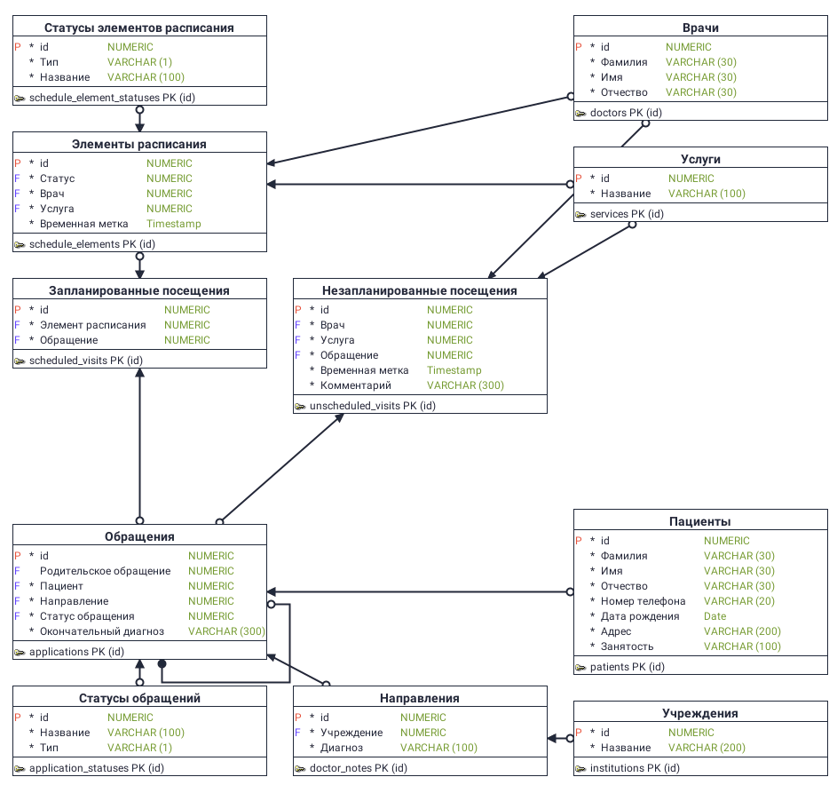

<div align="center">

  # База данных

</div>

## Схема данных



## Начать

Написал несколько скриптов для работы с базой данных. Проверялись на Oracle Database 21c

- [Генерация базы данных](scripts/database-generation.sql)
- [Удаление всех таблиц](scripts/drop-all-tables.sql)

## Установка Oracle XE

### 1. Установка Docker

Следуйте инструкции с [Официального сайта](https://docs.docker.com/engine/install)

### 2. Скачивание контейнера

```shell
docker pull gvenzl/oracle-xe
```

### 3. Запуск

```shell
docker run -d -p 1521:1521 -e ORACLE_PASSWORD=<ваш пароль> -v oracle-volume:/opt/oracle/oradata gvenzl/oracle-xe
```

### Параметры для подключения

Администратор базы данных: system

Пароль: <ваш пароль>

Порт: 1521

Имя службы: XEPDB1

## Ограничения

- В качестве СУБД должна использоваться Oracle, потому что она уже используется этой больницей
- При генерации схемы данных нужно убрать NOT NULL у поля parent_application_id в таблице applications. Я не смог этого сделать в Data Modeler'e

## Ссылки

- https://docs.docker.com/engine/install - официальный сайт Docker. Установка Docker
- https://hub.docker.com/r/gvenzl/oracle-xe - Docker-контейнер с Oracle XE
