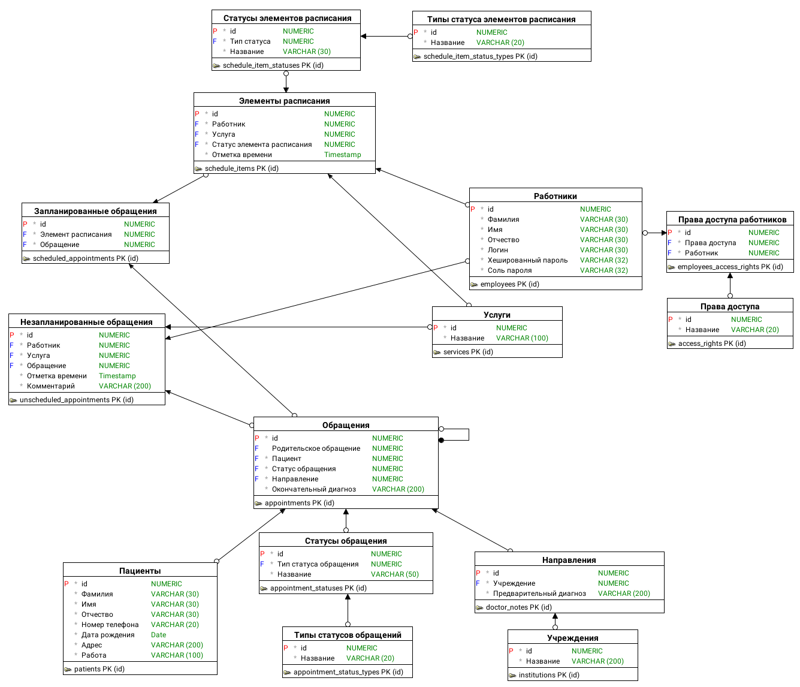

<div align="center">

  # :bookmark_tabs: База данных

</div>

## :diamond_shape_with_a_dot_inside: Логическая схема данных



## :lock: Ограничения

- В качестве СУБД должна использоваться Oracle, потому что она уже используется этой больницей

## :scroll: Скрипты

Написал несколько скриптов для работы с базой данных. Проверялись на Oracle Database 21c

- [Генерация базы данных](scripts/database-generation.sql)
- [Удаление всех таблиц](scripts/drop-all-tables.sql)

## :cry: Установка Oracle XE

- **Вручную.** Придётся попотеть. Внятных инструкций не найти, в документации Oracle не разобраться. Нужно переменные среды левые ставить, пакеты странные. Плюс сам Oracle блокирует скачивание из России, поэтому приходится качать обходными путями. Лучше даже не пытаться поставить этим способом.
- **Через Docker.** Здесь ситуация намного лучше. Настолько, что установка сводится к 2 командам. Я буду использовать только этот способ. Если это руководство не работает, то посмотрите [документацию](https://hub.docker.com/r/gvenzl/oracle-xe) этого контейнера.

### 1. Установка Docker

Следуйте инструкции с [Официального сайта](https://docs.docker.com/engine/install)

### 2. Скачивание контейнера

```shell
docker pull gvenzl/oracle-xe
```

### 3. Запуск

#### Без сохранения данных между сессиями

```shell
docker run -d -p 1521:1521 -e ORACLE_PASSWORD=<ваш пароль> gvenzl/oracle-xe
```

#### С сохранением данных между сессиями

```shell
docker run -d -p 1521:1521 -e ORACLE_PASSWORD=<ваш пароль> -v oracle-volume:/opt/oracle/oradata gvenzl/oracle-xe
```

### Параметры для подключения

Администратор базы данных: system

Пароль: <ваш пароль>

Порт: 1521

Имя службы: XEPDB1

## :information_source: Ссылки

- https://docs.docker.com/engine/install - официальный сайт Docker. Установка Docker
- https://hub.docker.com/r/gvenzl/oracle-xe - Docker-контейнер с Oracle XE