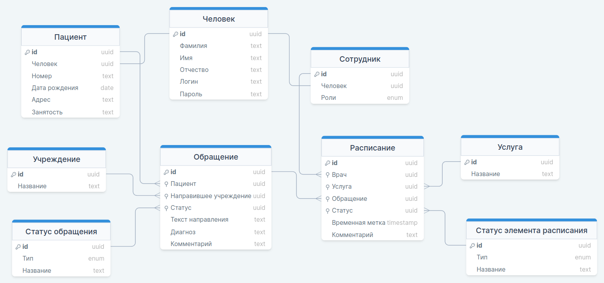

# База данных

## Схема данных

Создание схемы будет происходить автоматически через JPA. Поэтому инструкций по созданию бд здесь нет. Использоваться может любая СУБД. Для этого нужно добавить нужную зависимость в проект.